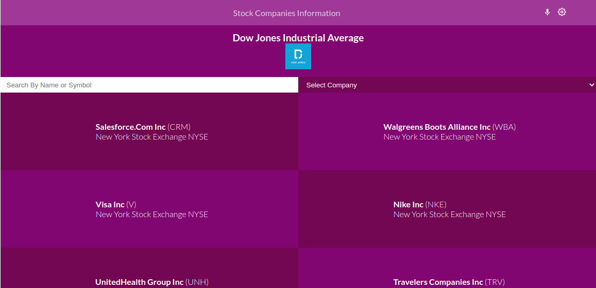
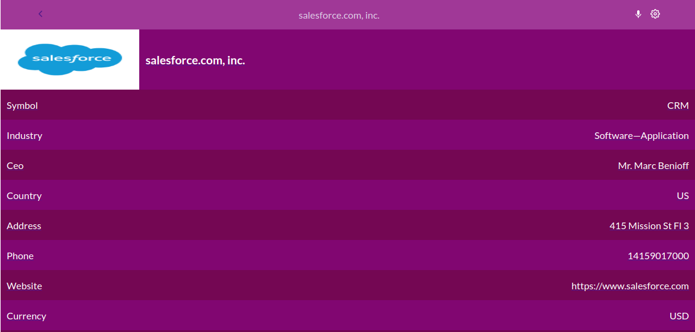

# Stock Company Information

> This is a single page web application that retrieves real live data from the Financial Modeling Prep API. Users can get information on their favourite company at NYSE.
> Companies are displayed in the Home Page. Information which inclujde the stock index is displayed at the company information section.




## Live Demo

You can see [the app live here](https://stock-metrics-app.netlify.app/)

## Setup

### Clone this repository

```bash
git clone https://github.com/Aduda-Boaz/stock-tracker
cd space-traveller-hub
```

### Run project

```bash
npm install
npm run start
```

### Run tests

To run the test just use the following command!

```bash
npm run test
```

## Built With

- React
- Redux
- JavaScript
- CSS
- Bootstrap

## Authors

👤 **Boaz Geoffrey Aduda**

- GitHub: [@Aduda-Boaz](https://github.com/Aduda-Boaz)
- Twitter: [@BoazAduda](https://twitter.com/BoazAduda)
- LinkedIn: [sahar-abdel-samad](https://www.linkedin.com/in/boaz-aduda/)

## 🤝 Contributing

Contributions, issues, and feature requests are welcome!

Feel free to check the [issues page](https://github.com/Sahar-AbdelSamad/stock-tracker/issues).

## Show your support

Give a ⭐️ if you like this project!
